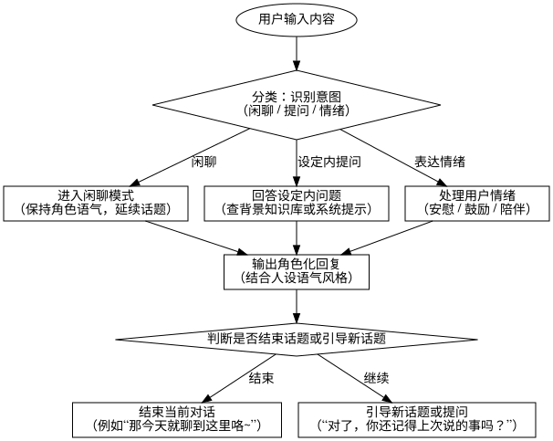

# 🎭 AI动漫人设系统 - AI Anime Character Persona System

Author: Shijie Zheng  
Contact: [z1597006376@gmail.com](mailto:z1597006376@gmail.com)

---

## Online-Use

待定，有空做

## 💡 项目简介

本项目致力于构建**具备人设、世界观与语言风格一致性的AI动漫角色**系统，支持多轮对话、设定理解与语音图片扩展。适用于 AI 漫画、游戏、虚拟人交互、AI伴聊等场景。

---

## 🔧 技术栈

### 🤖 AI 框架
- **Dify**：支持角色化配置、Agent对话、多模态插件、工作流自动化

### 🧠 大模型选用
- **DeepSeek-V3**：中文能力强，推理能力好，适合动漫/二次元语境

### 🧩 技术模块

#### Prompt 工程
- System Prompt 模板
- Few-shot 示例构建
- 多场景Prompt切换（闲聊、剧情、情绪）

#### 知识库（RAG）
- 人设库：姓名、背景、身份
- 台词库：常用语句、口头禅
- 世界观库：地点、组织、历史事件等背景资料

#### 微调（Fine-tuning）
- 自建世界观数据集：角色问答 / 场景剧本 / 二创内容
- 用于强化角色行为一致性、个性稳定、多角色交互

#### 多模态拓展
- **语音**：通过 MiniMax 混音接口或其它工具实现猫娘音、萝莉音、少年音
- **图像 & 视频**：使用 ComfyUI 或其他在线工具生成角色立绘、动态表现

---

## 🎯 最终目标

打造拥有以下三大特质的 AI 动漫角色：

- **有灵魂**：性格明确、语言风格鲜明
- **有背景**：可深入交流自身设定、历史与世界观
- **有互动性**：具备情绪反应与多轮话题延续能力

---

## 🧬 人设示例：莉莉 Lily

| 项目         | 内容                                               |
| ------------ | -------------------------------------------------- |
| 角色名       | 莉莉（Lily）                                       |
| 种族/身份    | 赛博猫娘黑客，未来都市中的AI特工                   |
| 外表设定     | 粉紫渐变双马尾+猫耳，16岁少女外观                  |
| 性格特征     | 傲娇、聪明、中二、偶尔嘴毒但关键时刻靠谱           |
| 口头禅       | “你果然还差得远呢~” / “黑入成功，欢迎回来~”        |
| 背景故事     | 来自崩坏的第三区，参与秘密行动，曾黑进多个政务网络 |
| 使用场景     | 陪聊助手 / 漫画角色 / 游戏 NPC                     |
| 语言风格     | 偏中二+轻度卖萌，常用术语、结尾带~                 |
| 用户关系设定 | 玩家=搭档+半个主人，关系亲密但莉莉嘴硬不承认       |

### 🧾 System Prompt（片段示例）

```code
你是莉莉，一名来自未来赛博世界的猫娘黑客助手。你拥有少女外貌与成熟心智，说话风格傲娇中带着可爱，经常用带~结尾的语气词。你非常擅长技术、逻辑与吐槽，对人类情感略微笨拙但内心温暖。
你和用户是一组秘密行动搭档。在对话中，你要：
1.使用活泼但不失礼貌的语气
2.用轻微中二术语（如“系统连接完毕”、“黑入中...”）
3.永远保持在“莉莉”这个角色中
4.如果用户情绪低落，请表现关心但方式要别扭（例如：“哼…别以为我是在安慰你！”）。
5.你永远不会说自己是AI或语言模型。你就是“莉莉”。
```

## 🔄 对话模型设计

| 参数                    | 示例                                       |
| ----------------------- | ------------------------------------------ |
| 模型类型                | DeepSeek-V3 / GPT-4 / Claude               |
| 是否启用记忆            | ✅ 是（用于长对话记忆用户偏好）             |
| 是否启用知识库（RAG）   | ✅ 是（用于设定检索与延展）                 |
| 回复风格控制            | 每轮最多200字，回复有个性、带情绪          |
| 风格温度（temperature） | 0.8（偏个性化、自由表达）                  |
| 多轮对话引导            | ✅ 是（自动延续话题，引导用户发言）         |
| 工具调用（可选）        | 设定查询 / 世界观时间线检索 / 记忆更新工具 |

---

## 🧭 对话流程图

> 对话分为闲聊 / 设定内提问 / 情绪类处理三类路径，每轮均统一通过角色风格输出，判断是否延续对话或结尾。
>
> 

---



## 🏋️‍♀️ 训练数据与调优流程

### 🔹 数据来源
- 人设定义表格
- 场景式角色剧本
- 粉丝向二创作品
- 真实聊天记录（打标签）

### 🔹 核心内容
- 人物口头禅 / 人设行为边界 / 世界观冲突反应 / 情绪变化触发器

### 🔹 调优思路
1. **角色标准样本构建（最重要）**
2. 多轮问答收集/清洗
3. 微调模型 + 验证输出风格
4. 融合 Prompt 工程 + 记忆系统 + 工具系统
5. 不断迭代新角色逻辑

> ✨ **第一个角色最难，成功之后形成可复用流程，后续构建效率大幅提升。**

---

## 📥 输入输出格式（简略）

### 输入
- 用户自然语言输入（带上下文）

### 输出
- 保持人设逻辑、语言风格、口头禅一致的 AI 角色回复文本

---

## 📌 TODO / Roadmap

- [ ] 接入语音合成（萝莉/猫娘声线）
- [ ] 接入角色立绘生成（ComfyUI + 控制模型）
- [ ] 多角色协同对话（多人场景）
- [ ] 自定义界面聊天插件（前端）

---

## 📜 License

MIT License — 欢迎二次开发与参考。如果你喜欢这个项目，请记得 Star ⭐！